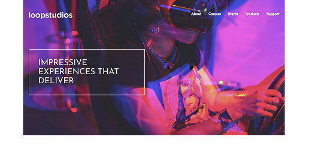

# Frontend Mentor - Loopstudios landing page solution

This is a solution to the [Loopstudios landing page challenge on Frontend Mentor](https://www.frontendmentor.io/challenges/loopstudios-landing-page-N88J5Onjw). Frontend Mentor challenges help you improve your coding skills by building realistic projects.

## Table of contents

- [Overview](#overview)
  - [The challenge](#the-challenge)
  - [Screenshot](#screenshot)
  - [Links](#links)
- [My process](#my-process)
  - [Built with](#built-with)
  - [What I learned](#what-i-learned)
- [Author](#author)

## Overview

### The challenge

Users should be able to:

- View the optimal layout for the site depending on their device's screen size
- See hover states for all interactive elements on the page

### Screenshot

Desktop view:

Mobile view:

### Links

- Github pages URL: [loopstudios website](https://pwtaberg.github.io/loopstudios-website/)

## My process

- In this case I followed a tutorial by Brad Traversy

### Built with

- Semantic HTML5 markup
- CSS custom properties
- Tailwind
- Flexbox
- CSS Grid
- Mobile-first workflow

### What I learned

The main purpose of this task was to get comfortable with using Tailwind
